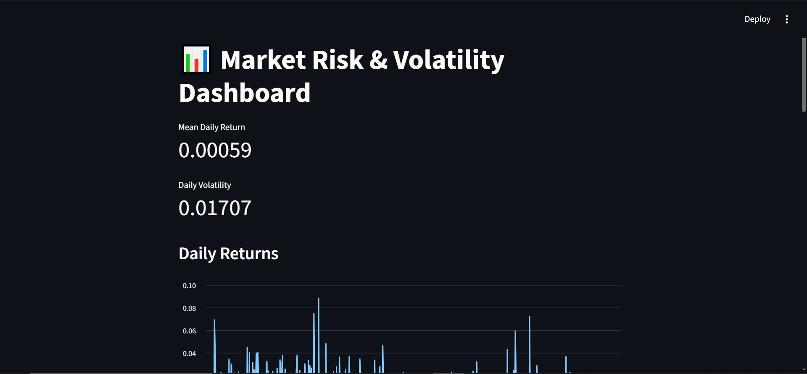
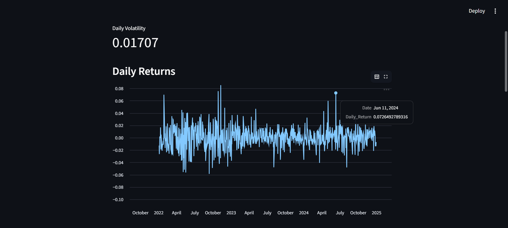
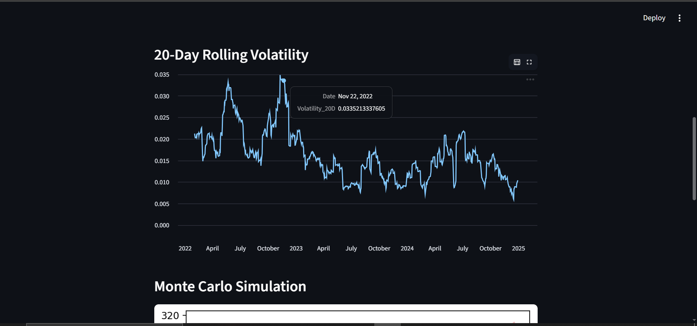

# Financial_Risk_Volatiity_Dashboard
Financial market risk and volatility dashboard built using Streamlit. Analyzes daily returns, rolling volatility, Monte Carlo simulations, and Value at Risk (VaR) using Python and financial data visualization.

# 📊 Market Risk & Volatility Dashboard

> Financial analytics dashboard for analyzing market risk, stock volatility, and future price behavior using Python & Streamlit 🚀

This project provides an interactive dashboard to help understand stock market fluctuations, risk levels, and possible future trends using statistical and financial analysis techniques.

---

## 🌐 Live Demo
👉 [Click here to view Dashboard](YOUR_STREAMLIT_LINK)

---

## 🖼️ Dashboard Preview

---

# 📌 Business Problem

Financial markets are highly unpredictable and volatile. Investors and analysts often struggle to:

- Understand daily market fluctuations
- Measure investment risk
- Predict possible future stock prices
- Identify potential losses during market downturns

Traditional spreadsheets and static reports make it difficult to visualize market behavior effectively.

### ✅ Solution

This dashboard helps analyze market risk using:
- Daily return analysis
- Volatility tracking
- Monte Carlo simulation
- Value at Risk (VaR)

It transforms raw financial data into meaningful visual insights for better decision-making.

---

# 💡 Key Features

- 📈 Daily Return Analysis
- 📊 20-Day Rolling Volatility
- 🎲 Monte Carlo Simulation
- ⚠️ Value at Risk (VaR) Calculation
- 📉 Interactive Charts & Metrics
- 📌 Expected Future Price Estimation

---

# 🛠️ Tools & Technologies Used

| Tool / Technology | Purpose |
|---|---|
| Python | Core programming language |
| Streamlit | Interactive dashboard development |
| Pandas | Data cleaning & analysis |
| NumPy | Numerical computations |
| Matplotlib | Data visualization |
| CSV Dataset | Historical market data storage |

---

# 🧠 Concepts Used

## 📈 Daily Return
Measures the percentage change in stock price from one day to another.

## 📉 Rolling Volatility
Calculates risk fluctuations over a 20-day moving window.

## 🎲 Monte Carlo Simulation
Uses random probability distributions to simulate future stock prices.

## ⚠️ Value at Risk (VaR)
Estimates the potential maximum loss at a 95% confidence level.

## 📊 Statistical Analysis
Used for calculating:
- Mean returns
- Standard deviation
- Price movement trends

---

# ⚙️ How the Dashboard Works

1. Historical market data is loaded from CSV
2. Daily stock returns are calculated
3. Rolling volatility is computed
4. Monte Carlo simulations predict possible future prices
5. VaR estimates downside risk
6. Results are visualized using charts and metrics

---

# 📊 Dashboard Insights

## 📈 Daily Returns Chart
Shows how stock returns fluctuate daily.

### Insight:
- Helps identify unstable market periods
- Detects sudden spikes or drops in returns

---

## 📉 Rolling Volatility Chart
Displays changing market volatility over time.

### Insight:
- Higher volatility indicates higher market uncertainty
- Useful for risk monitoring

---

## 🎲 Monte Carlo Simulation
Generates multiple possible future stock price paths.

### Insight:
- Helps estimate expected future price trends
- Useful for investment planning

---

## ⚠️ Value at Risk (VaR)
Measures potential downside loss.

### Insight:
- Helps investors estimate worst-case losses
- Useful for portfolio risk management

---

# 🎯 Use Cases

- 📊 Financial Risk Analysis
- 💼 Investment Decision Support
- 📈 Market Trend Monitoring
- 🧠 Portfolio Risk Assessment
- 🎓 Educational Finance Projects
- 📑 Data Analytics Practice Project

---

# 📌 Advantages

- Easy-to-understand financial analysis
- Interactive dashboard visualization
- Fast risk estimation
- Useful for beginners in finance & analytics
- Simplifies complex financial concepts

---

# ⚠️ Limitations

- Uses historical data only
- Predictions are simulation-based, not guaranteed
- Does not include real-time stock market API
- Market conditions may change unpredictably

---

# 🔮 Future Enhancements

- 📡 Real-time stock market integration
- 🤖 AI-based price prediction
- 📊 Advanced interactive visualizations
- 🌍 Multi-stock comparison
- 📱 Mobile-friendly dashboard
- ☁️ Cloud database integration

---

👩‍💻 Author

Gauri Borse
✨ Passionate about Data Analytics and data science

⭐ Support

If you like this project:

⭐ Star this repository
🍴 Fork it
📢 Share it with others
